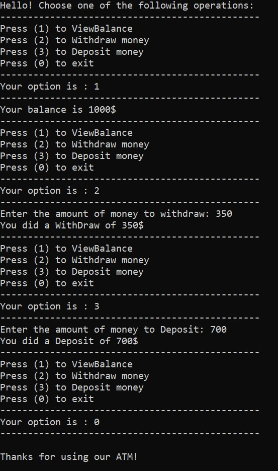
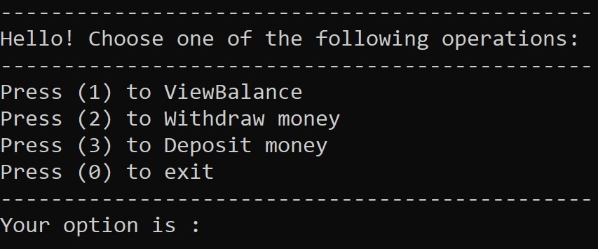
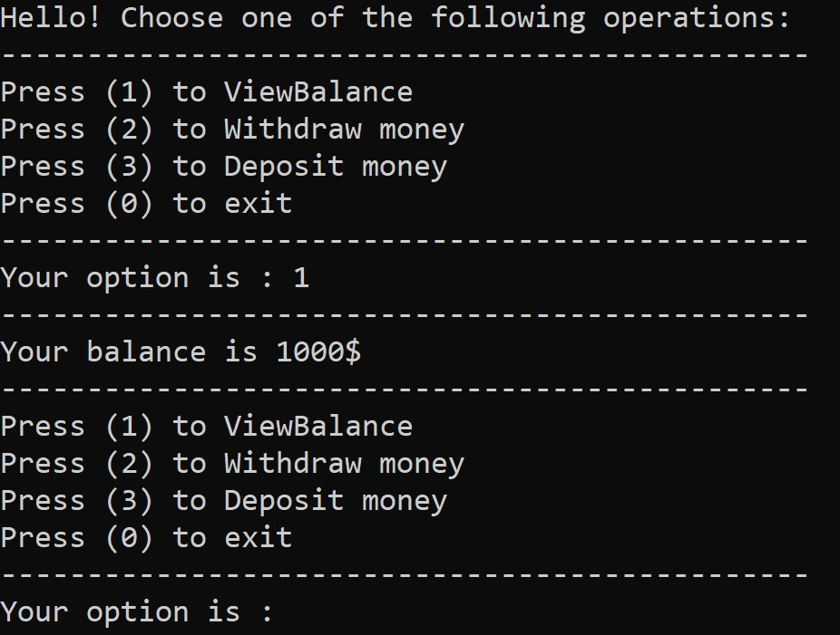
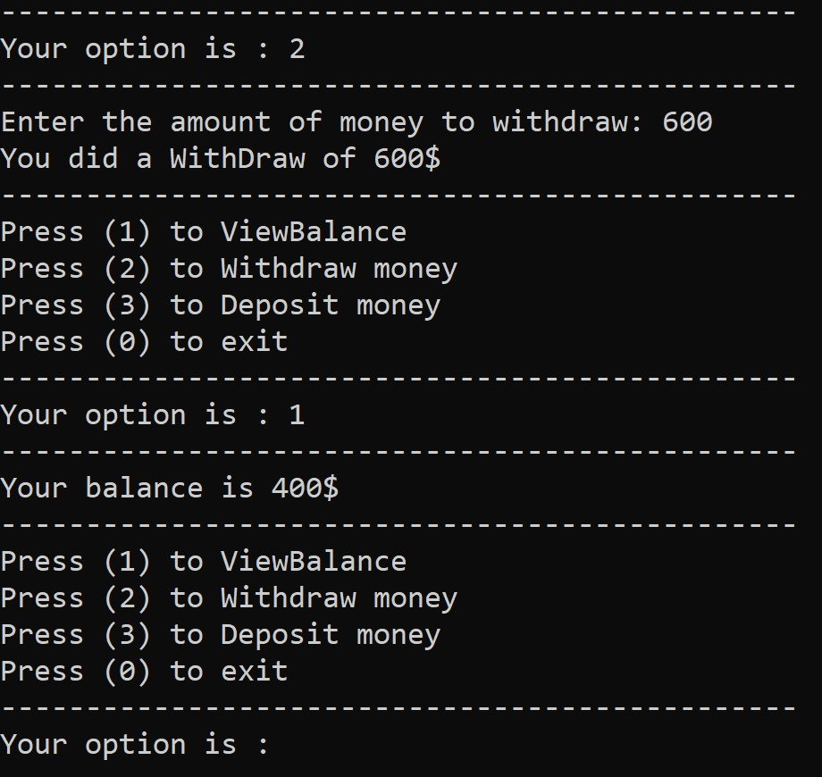
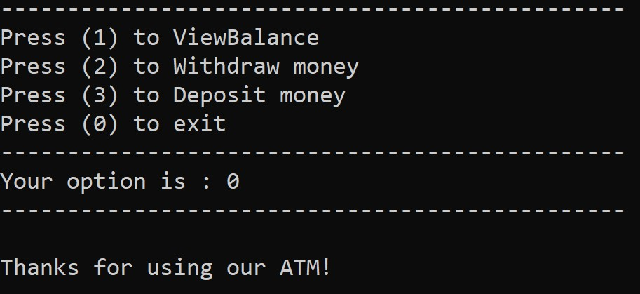
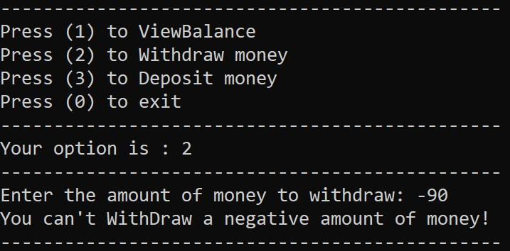
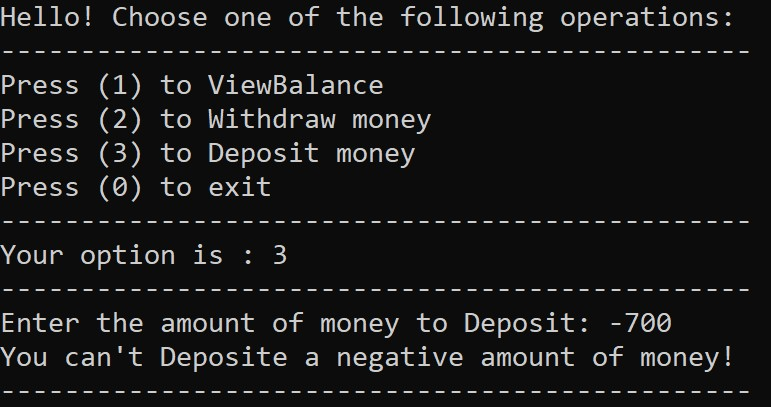
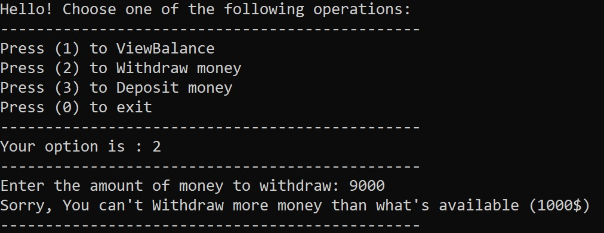
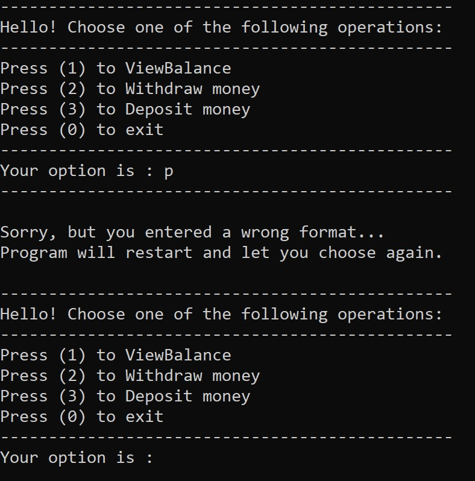

# Lab02-UnitTests-Documentation
---
This project is an ATM console application which allows the user to view his/her balance, deposit money and withdraw money from his/her bank account.

The application provides a simple user interface, the user just have to choose the operation by clicking a number. There are 4 options which are:

+ Press (0) to exit
+ Press (1) to ViewBalance
+ Press (2) to Withdraw money"
+ Press (3) to Deposit money
---
### Below is an image of the user interface:
*The image shows a welcoming message and a list of operations performed on a bank account using our app.*

---
## Step by step directions on how to use the app:
1. Choose one the following operations by entering a number for your operation.
 	
	
2. If you choose 1, it will show you your balance which is 1000$ and ask you to choose another option unless you want to exit by entering (0).
 
	
	
3. Let's choose Withdraw by entering 2 and of an ammount 600, then let's choose 1 to view the balance. It shows 400$ left.
	
4. Last step, let's exit the ATM by entering (0). It thanks the user for using this ATM app and exit the app.
	
---
## Some relevant details:
+ This app is tested and will make sure that your money is safe and won't make calculation.
+ If you choose a wrong number for the operations, don't worry cause nothing will happen and the list will show up. So you can proceed your transactions.
+ Negative values are not accepted for withdraw and deposit operations.

	
	
	
	
+ Be careful when you withdraw money; because your balance can't be below zero, but if you do that the app will prompt you and show you your balance.

	
	
+ Don't worry about wrong format errors; cause it will be handeled and your app will keep working. 	
	
	